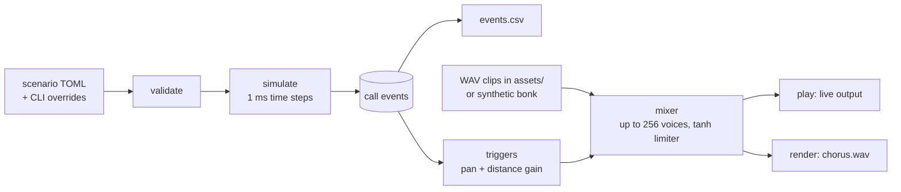
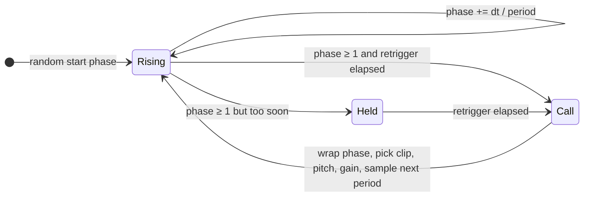
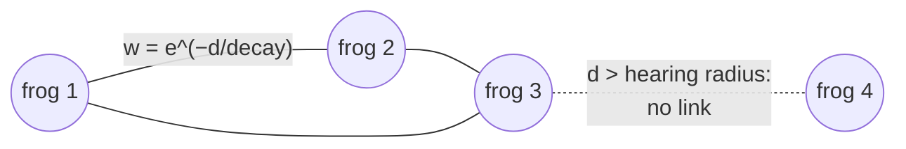

# hold-my-banjo

A chorus simulator for the eastern banjo frog (pobblebonk, *Limnodynastes dumerilii*). It places a number of frogs in a 2D scene, simulates when each one calls, and mixes the "bonk" calls into stereo audio. Each frog is panned and attenuated according to where it sits in the scene.

To hear what a real banjo frog chorus sounds like, listen to [audio/banjo-frogs-long.m4a](audio/banjo-frogs-long.m4a). It is a reference recording for comparing with the simulation, not an input to it.

## Usage

```sh
cargo run --release -- play                    # play the chorus live on the default output device
cargo run --release -- render                  # render to out/chorus.wav and log calls to out/events.csv
cargo run --release -- analyze out/events.csv  # per-frog call intervals and chorus overlap
```

Scenarios are TOML files, and `scenarios/default.toml` is the default. You can override most parameters from the command line (`--frogs`, `--seed`, `--duration`, `--mode`, `--strength`, `--mean-interval`, `--hearing-radius`, …). Run `cargo run -- play --help` to see the full list.

## Call clips

Call samples are loaded from the `.wav` files in `assets/` (configure this with `audio.asset_dir` or `--assets`). If that folder has no WAV files, the simulator uses a synthetic placeholder bonk.

## Behaviour modes

- `independent`: each frog calls on its own jittered rhythm.
- `event_delay`, `event_advance` and `phase_coupled`: frogs react to calls from neighbours within hearing range. These modes are **hypothetical**. They are borrowed from Japanese tree frog models and have not been validated for banjo frogs.

The bundled default scenario is marked `experimental`. Its values are placeholders, not measured species data.

## Approach

The simulator works in two stages. First it simulates when each frog calls. Then it renders audio from the resulting list of call events. Since the events are fixed before any audio is produced, a given seed always gives the same CSV and the same WAV.



### Frogs as oscillators

Each frog is placed at a random spot in a `width_m × depth_m` scene, with its own seeded random number stream. It gets an intrinsic call interval drawn around `mean_interval_s`. A phase value climbs from 0 to 1 over one interval, and the frog calls when the phase reaches 1. After each call it draws a new jittered interval, clamped to `[min_interval_s, max_interval_s]`. It can't call again until `min_retrigger_s` has passed, and if the phase reaches 1 before then, it holds at 1 until the frog is allowed to call.



### Hearing and coupling

Frogs within `hearing_radius_m` of each other are linked. The strength of each link falls off with distance d as `exp(-d / hearing_decay_m)`. How the links are used depends on the mode:

- `independent`: links are ignored.
- `event_delay` / `event_advance`: when a frog calls, each neighbour that hears it moves its phase back or forward by `k · w · sin(π·phase)`, where `k` is the coupling strength and `w` is the link weight. Each link then waits `response_cooldown_s` before it can nudge that neighbour again.
- `phase_coupled`: at every time step, each frog's phase is pulled toward its neighbours' phases (Kuramoto-style: `−k · dt · Σ w · sin(2π(φⱼ − φᵢ))`). Optional `phase_noise` adds random jitter to the phase.



### Mixing

The listener sits at the front-centre of the scene (x = 0, y = 0), and `f` marks a frog:

```
            y = depth_m
   ┌───────────────────────────┐
   │   f          f            │
   │         f           f     │
   │  f            f        f  │
   └─────────────▲─────────────┘
  x = −width/2   listener   x = +width/2
                 (0, 0)
```

Each call becomes a trigger on an exact sample frame, with these settings:

- **Pan:** constant-power panning based on x, scaled by `stereo_width`.
- **Distance gain:** `5 / (5 + d)`, where d is the frog's distance from the listener in metres.
- **Per-call variation:** small random changes to pitch (`pitch_sd_semitones`) and gain (`gain_sd_db`).

The mixer plays the clips back as voices, resampling with linear interpolation, sums the voices, and runs the result through a `tanh` soft limiter. `play` and `render` use the same mixer, so what you hear live matches the rendered file.

## License

[MIT](LICENSE)
